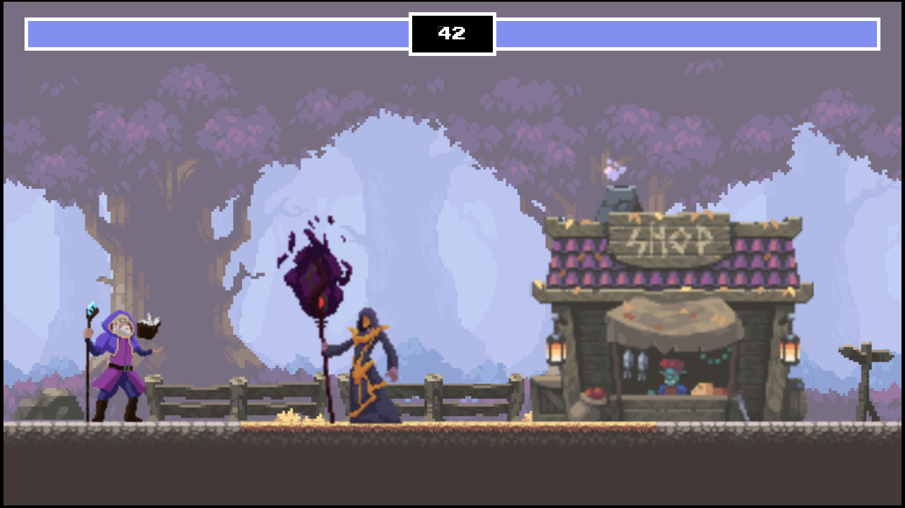

# Canvas Fighting Game - Enhanced Edition

一个基于Canvas的2D格斗游戏，支持中英文双语界面。



## 🎮 游戏特色

- **多角色选择**：4个独特角色（武士剑二、武士麦克、法师阿拉塔、法师阿尔布斯）
- **多种游戏模式**：
  - PVP模式：双人对战
  - PVE模式：人机对战，支持3种AI难度
- **国际化支持**：完整的中英文双语界面
- **实时语言切换**：游戏中可随时切换语言
- **AI智能对手**：
  - 爽玩模式：适合新手
  - 专家模式：平衡挑战
  - 大师模式：高难度挑战

## 🚀 快速开始

### 安装依赖
```bash
npm install
```

### 启动开发服务器
```bash
npm run dev
```

### 构建生产版本
```bash
npm run build
```

## 🎯 游戏操作

### 玩家1控制
- **移动**：A/D 键
- **跳跃**：W 键
- **攻击**：空格键

### 玩家2控制
- **移动**：←/→ 方向键
- **跳跃**：↑ 方向键
- **攻击**：Enter 键

## 🌟 主要改进

相对于原始项目，本版本新增了以下功能：

### 1. 国际化系统
- 🌐 **完整的中英文支持**：所有界面文本都支持双语显示
- 🔄 **实时语言切换**：无需重启游戏即可切换语言
- 💾 **语言偏好记忆**：自动保存用户的语言选择
- 📝 **参数化文本支持**：支持动态内容插入（如回合数显示）

### 2. 用户界面优化
- 🎨 **美观的语言切换按钮**：位于右上角，支持悬停效果
- 📱 **响应式设计**：适配不同屏幕尺寸
- 🎭 **角色名称本地化**：角色名称支持中英文显示
- 🏷️ **完整的UI文本翻译**：包括按钮、提示、状态信息等

### 3. 技术架构改进
- 🏗️ **模块化语言管理**：独立的语言管理器，易于扩展
- 🔧 **类型安全**：完整的TypeScript类型定义
- 🎯 **事件驱动**：语言变更时自动更新所有相关UI
- 🚫 **循环依赖解决**：优化了模块加载顺序，避免初始化问题

### 4. 代码质量提升
- 📋 **统一的代码风格**：遵循最佳实践
- 🐛 **错误修复**：解决了原版本中的多个bug
- 🔍 **更好的错误处理**：增强了系统稳定性
- 📚 **完善的注释**：提高代码可维护性

## 📁 项目结构

```
src/
├── language-manager.ts     # 语言管理系统
├── language-switch.css     # 语言切换按钮样式
├── start-screen.ts         # 开始界面（已国际化）
├── game.ts                 # 游戏主逻辑（已国际化）
├── main.ts                 # 应用入口
├── fighters/               # 角色定义
├── ai-controller.ts        # AI控制器
└── ...
```

## 🛠️ 技术栈

- **TypeScript**：类型安全的JavaScript
- **Canvas API**：2D图形渲染
- **Vite**：现代化构建工具
- **CSS3**：样式和动画

## 🎨 语言切换功能

本项目的亮点功能是完整的国际化支持：

1. **智能语言检测**：自动检测浏览器语言偏好
2. **实时切换**：点击右上角按钮即可切换语言
3. **全面覆盖**：从开始界面到游戏结束的所有文本
4. **持久化存储**：记住用户的语言选择

## 📄 许可证

本项目基于原始Canvas Fighting Game项目开发，遵循相同的开源许可证。

## 🤝 贡献

欢迎提交Issue和Pull Request来改进这个项目！

---

**Enhanced by**: 添加了完整的国际化支持和用户体验优化
**Original Project**: Canvas Fighting Game
